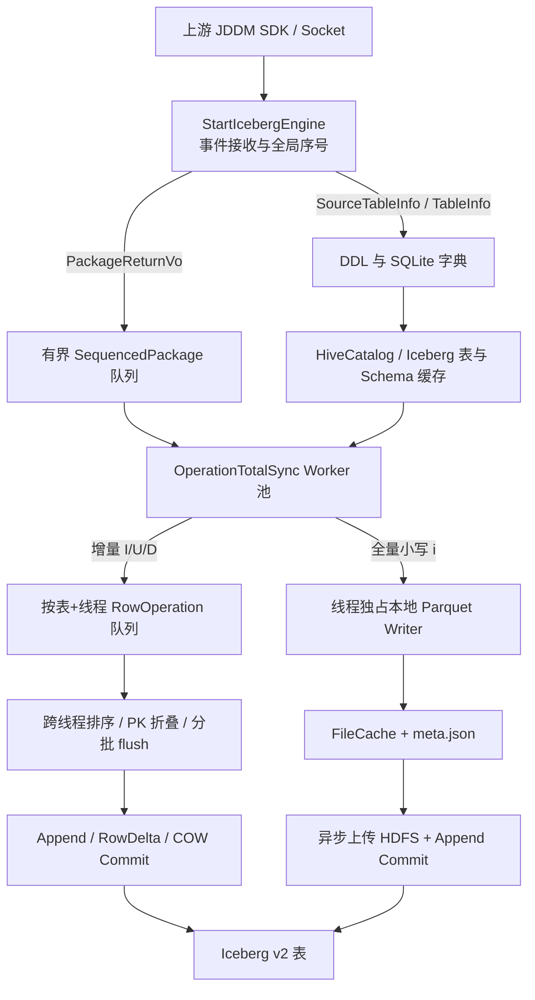

# JDDM Iceberg Engine By SDK

基于 JDDM 内部 SDK、Apache Iceberg 与 Hive Metastore 的 CDC 落湖引擎。程序通过 Socket 接收 DDL、全量数据包和增量 DML 数据包，将源端字段转换为 Iceberg `GenericRecord`，最终以 Parquet Data File、Equality Delete File 或 COW 重写的方式提交到 Iceberg v2 表。

> 本文档依据 `master-dev` 分支当前代码整理。它描述的是**实际执行逻辑**，并单独标注了已实现但未启用、仅兼容保留或当前存在限制的功能。

## 目录

- [核心能力](#核心能力)
- [总体架构](#总体架构)
- [程序启动与运行流程](#程序启动与运行流程)
- [DDL 与元数据流程](#ddl-与元数据流程)
- [CDC 数据处理流程](#cdc-数据处理流程)
- [增量写入模式](#增量写入模式)
- [全量写入流程](#全量写入流程)
- [顺序、一致性与失败恢复](#顺序一致性与失败恢复)
- [模块与组件](#模块与组件)
- [配置参数](#配置参数)
- [类型映射](#类型映射)
- [构建与启动](#构建与启动)
- [运行目录与外部依赖](#运行目录与外部依赖)
- [监控与运维](#监控与运维)
- [当前限制与注意事项](#当前限制与注意事项)

## 核心能力

- 通过 JDDM Socket SDK 接收源表 DDL、目标表 DDL、全量数据和增量 CDC 数据。
- 使用 HiveCatalog 管理 Iceberg v2 表，支持自动创建 namespace、建表、加载已有表和按配置删表重建。
- 支持两类业务写入语义：
  - `trajectory`：轨迹/审计模式，I/U/D 都转成追加记录。
  - `transaction`：镜像/事务模式，基于主键生成 upsert、Equality Delete 或 COW 重写。
- 支持三种 transaction 落盘策略：`COW_MODE=batch|timer|none`。
- 增量数据支持跨 worker 的全局排序、同批主键折叠、按表串行 flush 和提交冲突重试。
- 全量数据使用逐行本地 Parquet 直写和异步 HDFS 提交，降低宽表和大批量同步时的堆内存压力。
- 支持普通认证与 Kerberos keytab 登录，并每小时检查 TGT 续约。
- 使用 SQLite 保存表字典，重启后可预加载，DDL 变更后可延时刷新。
- 支持优雅停止：停止接收、等待队列消费、关闭全量 writer、强制冲刷增量缓存。

## 总体架构



### 关键内存结构

| 结构 | Key / 内容 | 作用 |
|---|---|---|
| `icebergEngineOperationQueue` | `SequencedPackage`，默认容量 10000 | Socket 接收端和 CDC worker 之间的有界队列 |
| `IceBergSchemaCahceMap` | `schema.table -> Schema` | 当前写入 Schema |
| `IceBergCacheTableMap` | `schema.table -> Table` | Iceberg 表句柄 |
| `TablePkColCacheMap` | `schema.table -> PK 列名列表` | PK 合并和 Equality Delete |
| `tableColumnPosCache` | `schema.table -> 列名/位置` | 热路径按列下标写 `GenericRecord` |
| `tableColumnConvertersCache` | `schema.table -> 转换器数组` | 预绑定 String 到 Iceberg Java 类型的转换器 |
| `columnTypeCache` | `schema.table.column -> Type` | 转换器缓存缺失时的降级路径 |
| `IceBergSchemaImmuTableOpsMap` | `schema.table.threadId -> LinkedBlockingDeque<RowOperation>` | 每 worker、每表的增量缓存；Deque 支持失败时 `addFirst` 回滚 |
| `fullLoadDirectWriterMap` | `schema.table.threadId -> FullLoadDirectWriter` | 每 worker、每表独占的全量本地 Parquet writer |
| `lastDataWriteTimerByParquetMap` | `schema.table.threadId -> 最后写入时间` | 静默超时 flush |
| `engineAtomicByTableKeyMap` | `schema.table.threadId -> 当前批次行数` | 达到阈值后主动 flush |
| `cumulativeRowsByTableMap` | `schema.table -> 累计行数` | 监控统计 |

## 程序启动与运行流程

实际业务入口是：

```text
com.jddm.boot.StartIcebergEngine
```

`com.jddm.boot.Main` 当前只输出 `Hello world!`，不是引擎入口；JAR Manifest 也没有配置 `Main-Class`。

启动顺序如下：

1. 以 JVM `user.dir` 作为引擎根目录，并同步设置内部 SDK 的工作目录。
2. 从 `config/config.properties` 加载应用参数，写入 `Constant`、内部 SDK 常量和启动参数日志表。
3. 初始化服务：
   - 普通模式跳过认证；Kerberos 模式使用 keytab 登录。
   - 从本地 SQLite 预加载已保存的表字典并创建/加载 Iceberg 表。
   - 注册 `SIGTERM`、`SIGINT` 信号处理器。
   - 每 5 秒执行一次空闲数据 flush 定时器。
   - 每 5 秒检查一次 SQLite DDL 重载任务。
   - 每小时检查一次 Kerberos TGT 续约。
   - 启动一个全量异步提交器；它每 5 秒扫描一次 `FileCache`。
   - 创建固定大小 50 的线程池，并按 `ENGINE_THREAD_TOTAL_SYNC_CONCURRENT` 启动实际 CDC worker。
4. 输出引擎和 Iceberg 版本信息。
5. 扫描模块目录；如果存在 `jddm.engine.module.databaseOperation.jar`，动态加载数据库监控模块。
6. 以 `SERVERPORT`、`THREADPOOLSIZE` 和硬编码 Socket 队列容量 1000 创建 `SocketGeneralEngine`。
7. 启动 Socket 服务并按收到的对象类型分派事件。

### Socket 事件分派

| 事件类型 | 处理行为 |
|---|---|
| `ExecSQLInfoVo` | 当前仅输出 SQL 内容 |
| `SourceTableInfoVo` | 转成 `TableInfoVo`，写入源表缓存和 SQLite 的 `<schema.table>_source` 记录 |
| `TableInfoVo` | 合并源/目标字典，写 SQLite；若表未缓存则创建或加载 Iceberg 表 |
| `PackageReturnVo` | 在接收线程立即分配全局递增包序号，包装为 `SequencedPackage` 后放入有界队列 |
| 其他对象 | 输出类名和对象内容 |

接收端在 JVM 堆使用率超过 80% 时先暂停 10 秒，再向有界队列执行阻塞 `put`，形成基础背压。

## DDL 与元数据流程

### 首次或实时 DDL

1. `SourceTableInfoVo` 到达后保存源表字典。
2. `TableInfoVo` 到达后将源端类型信息合并到目标字典并持久化到 SQLite。
3. `IceBergTableOperationByEngine#importHiveTable_IceBerg_Table`：
   - 解析字段、主键和附加列。
   - 构建 Iceberg Schema；`transaction` 模式下新建表的 PK 字段标记为 required。
   - 校验 `Hive.Table.Partition.Name`，存在时使用 identity partition，否则建非分区表。
   - 初始化 HiveCatalog，固定使用 Iceberg `format-version=2`，并设置 `lock.enabled=false`。
   - namespace 不存在时自动创建。
   - 表不存在：创建表。
   - 表存在且 `DROP_TABLE_FLAG=true`：删除数据和元数据后重建。
   - 表存在且 `DROP_TABLE_FLAG=false`：加载已有表，并以 HMS 中的实际 Schema 覆盖内存 Schema。
   - 根据实际 Schema 过滤不存在的 PK 列。
   - 构建列位置、字段类型和类型转换器缓存。

当前代码对已有表执行的是“加载”，没有调用 Iceberg `UpdateSchema` 做增删列演进。因此 DDL 变化是否真正反映到已有表，取决于表是否已由外部完成变更，或是否启用了删表重建。

### 重启预加载

启动时遍历 SQLite 的全部表 key，排除 `_source` 记录，再恢复源/目标字典、JVM 表缓存和 Iceberg 表句柄。单表加载失败不会阻止其他表继续加载。

### 延迟 DDL 重载

`ReLoaderTableInfoBySqliteDB` 每 5 秒执行一次。检测到内部 SDK 的 DDL 变更缓存后累计 3 次再重载，即正常情况下约 15 秒触发。当前实现会遍历内存里的全部表重新调用导入逻辑，而不仅是变更表。

## CDC 数据处理流程

### 1. 全局包序号

`PackageReturnVo` 在 Socket 回调线程中立即获得单调递增的 `pktSeq`。每行的逻辑偏移量计算为：

```text
binlogOffset = pktSeq * 1_000_000 + rowNo
```

当一次 UPDATE 被拆成 DELETE + INSERT 时，第二个操作使用 `offset + 1`。这不是源端真实 LSN，而是本进程内用于跨 worker 恢复到达顺序的逻辑序号；进程重启后会从 0 重新计数。

### 2. 全量与增量识别

代码对操作类型大小写有特殊约定：

| 原始 `operationType` | 含义 |
|---|---|
| 小写 `i` | 全量加载，走逐行本地 Parquet 直写路径 |
| 大写 `I` | 增量 INSERT |
| 大写 `U` | 增量 UPDATE |
| 大写 `D` | 增量 DELETE |

CDC 包内如果出现内部 `MergerColKeyName` 控制列，还会按行覆盖为 I/U/UA/UB/D 语义。

### 3. 前镜像与后镜像

增量列通过 `cflag` 的最低位区分镜像：

```text
(cflag & 1) == 1  -> before image / oldRecord
(cflag & 1) == 0  -> after image  / newRecord
```

字段值先通过表级预计算转换器变成 Iceberg 需要的 Java 类型，再按列位置写入 `GenericRecord`。转换失败时当前策略通常是记录 warning 并将该字段留空，而不是终止整个数据包。

### 4. RowOperation 生成规则

| 输入 | transaction 且有 PK | trajectory 或无法使用 PK |
|---|---|---|
| INSERT | INSERT | INSERT |
| UPDATE，前后镜像且 PK 不变 | UPDATE(old,new) | old、new 各追加一条 |
| UPDATE，PK 变化 | DELETE(old) + INSERT(new) | old、new 各追加一条 |
| UPDATE，只有后镜像 | DELETE(new) + INSERT(new)，作为 blind upsert | 追加 new |
| UPDATE，只有前镜像 | DELETE(old) | 追加 old |
| DELETE | 优先选择 PK 完整的 old，其次 new；两侧 PK 都不完整则跳过 | 追加 old/new，形成删除轨迹 |

无主键表在 flush 阶段固定按轨迹表处理，即使配置了 `ICEBERG_WRITE_MODE=transaction` 也不会生成 Equality Delete。

### 5. 缓存与 flush

增量操作先写入 `schema.table.threadId` 对应的 Deque。有两种触发方式：

- 计数触发：任一 worker 的表级行数达到 `HIVE_FILE_COUNT_NO`，立即 flush 该表的所有 worker 队列。
- 空闲触发：定时器发现最后写入时间超过 `HIVE_FILE_MODIFY_TIMES` 秒，flush 该表。

每张表都有独立 `ReentrantLock`，同一表一次只能有一个 flush。flush 会收集所有 worker 队列，按 `binlogOffset` 全局排序，再按最多 100000 个 `RowOperation` 拆批提交。

## 增量写入模式

### trajectory：历史轨迹追加

- 不生成 Delete File，也不扫描旧数据。
- UPDATE 通常追加 before 和 after 两条；DELETE 追加被删除镜像。
- 适用于审计、回放或保留完整变化历史，不代表源表当前镜像。

### transaction + COW_MODE=none：RowDelta

- 先在当前批次内按 PK 折叠操作。
- INSERT 同时生成 equality delete 和新记录，实现 blind upsert。
- UPDATE 生成旧 PK delete 和新记录。
- DELETE 只生成 equality delete。
- 使用 `table.newRowDelta()` 一次提交 Data File 与 Equality Delete File。
- 查询引擎必须正确读取 Iceberg v2 Equality Delete，才能看到最终镜像。

### transaction + COW_MODE=timer：RowDelta + 计划中的定时重写

实时写入行为与 `none` 相同。设计上由定时 compact 任务再做去重和小文件合并，但当前启动类中的 compact 调度被注释，所以仅配置 `timer` 不会自动启动维护任务。

### transaction + COW_MODE=batch：实时 COW

1. 合并当前批次同一 PK 的操作。
2. 收集受影响 PK。
3. 规划并读取当前表的 Data File，找出包含受影响 PK 的文件。
4. 从命中文件中剔除旧记录，加入本批新记录。
5. 使用 `OverwriteFiles` 原子删除旧 Data File 并添加重写后的 Data File。

该模式不依赖查询端支持 Equality Delete，但更新批次会扫描现有文件，表越大、受影响文件越多，延迟和内存成本越高。

### 同批 PK 折叠

主要折叠规则如下：

| 先前操作 | 后续操作 | 批次最终操作 |
|---|---|---|
| INSERT | INSERT | 后一个 INSERT |
| INSERT | UPDATE | INSERT(new) |
| INSERT | DELETE | 抵消，不写 |
| UPDATE | UPDATE | UPDATE(最初 old, 最后 new) |
| UPDATE | DELETE | DELETE(最初 old) |
| DELETE | INSERT | UPDATE(old,new) |
| DELETE | DELETE | 后一个 DELETE |
| DELETE | UPDATE | UPDATE(old,new) |

`INCREMENTAL_FAST_MODE` 可以跳过内部 PK 折叠，但当前没有对应的 `config.properties` 参数，代码默认固定为 `false`。

## 全量写入流程

全量包使用小写 `i` 标识，正常主路径不会进入增量 `RowOperation` 队列。

1. worker 逐行构建一个 `GenericRecord`，写入本线程、本表独占的本地 Parquet `FileAppender`。
2. 本地文件位于 `FileCache/<schema.table>/`，使用 Snappy 压缩。
3. 按列宽动态滚动文件：
   - 列数 `> 300`：10000 行/文件，8 MiB row group，128 KiB page。
   - 列数 `101..300`：30000 行/文件，16 MiB row group，256 KiB page。
   - 列数 `<= 100`：80000 行/文件，64 MiB row group，512 KiB page。
4. 文件达到阈值、表空闲或收到停止信号时关闭 writer，并把 DataFile Metrics 序列化为同名 `.meta.json`。
5. `IcebergFullLoadAsyncCommitter` 每 5 秒扫描缓存目录；不同表可并行处理，同一表同一时刻只允许一个任务。
6. Parquet 先上传到 HDFS 的 `.tmp` 路径，再原子 rename 到最终 data 路径。
7. 同一轮准备完成的 Data File 使用一次 `AppendFiles` 批量 commit；冲突最多重试 3 次。
8. 成功后按 `LOCAL_FILE_DELETE_POLICY` 删除、备份或保留本地 Parquet 和 meta 文件。

全量异步上传会把 HDFS 客户端的 `dfs.replication` 强制设置为 1，并把 socket timeout 设置为 120000 ms。这会覆盖 `hdfs-site.xml` 中的副本数 3，仅影响该上传客户端创建的新文件。

## 顺序、一致性与失败恢复

### 顺序保证

- Socket 回调处单线程分配包序号，避免在 worker 内分配造成竞争乱序。
- 增量 flush 汇总该表所有 worker 队列，并按逻辑 offset 排序。
- 同一表的 flush 由表级锁串行化。
- 同一全量表的异步提交由 `processingTables` 防止并发 commit。

### 提交原子性

- 增量 RowDelta：Data File 与 Delete File 在一次 Iceberg snapshot commit 中原子生效。
- COW：旧文件删除与新文件添加在一次 `OverwriteFiles` commit 中原子生效。
- trajectory 和全量：每次 `AppendFiles` commit 原子添加这一批 Data File。

应用层并没有跨表事务；不同表的提交相互独立。

### 重试与回滚

- RowDelta、COW 和全量 Append 的 commit 冲突最多重试 3 次，并在重试前 refresh 表元数据。
- 增量 flush 失败时，尚未确认处理的 `RowOperation` 会按原顺序 `addFirst` 回第一个 worker Deque，等待后续重试。
- 全量上传或提交失败时，本地 `.parquet` 和 `.meta.json` 会保留，下一次 5 秒轮询继续尝试。
- HDFS 上传通过“临时文件 + rename”避免把半文件作为最终 Data File 使用。

### 停止流程

收到 `SIGINT` 或 `SIGTERM` 后：

1. 把引擎状态切换为停止，关闭定时线程池。
2. 关闭并落盘所有全量 direct writer。
3. 最多等待 60 秒让入口有界队列被 worker 消费完。
4. 强制 flush 所有仍有增量操作的表。
5. 写停止状态并以 `System.exit(-1)` 退出。

全量 writer 在停止时只保证本地 Parquet 和 meta 已落盘；代码没有等待异步上传线程把这些文件 commit 到 Iceberg。只要 `FileCache` 被持久保留，下一次启动后可继续扫描提交。

## 模块与组件

### 启动、生命周期与配置

| 类/文件 | 功能 | 当前状态 |
|---|---|---|
| `boot/StartIcebergEngine` | 实际主入口、参数加载、服务初始化、Socket 事件分派、SQLite 预加载 | 主路径 |
| `boot/Main` | 输出 `Hello world!` | 占位，不是业务入口 |
| `boot/ThreadPoolManager` | 固定线程池 builder | 当前主路径未使用 |
| `conf/Configuration` | 读写 Java Properties | 主路径只使用读取 |
| `conf/InitConfigParameter` | 参数校验、默认值、内部常量初始化 | 主路径 |
| `conf/GlobalConfInfo` | 运行计数器、逻辑序号、SQLite/配置对象和监控数据 | 主路径 |
| `conf/GlobalSetConfInfo` | Iceberg Table/Schema/PK/转换器/队列/writer 等全局缓存 | 主路径 |
| `common/Constant` | 应用运行参数与开关 | 主路径 |
| `killOper/JddmEngineKillHandler` | SIGINT/SIGTERM 优雅停止和尾数据 flush | 主路径 |
| `manager/ServiceManager` | 统一关闭 Socket/线程池的封装 | 当前未接入主路径 |

### DDL、CDC 与写入

| 类 | 功能 | 当前状态 |
|---|---|---|
| `operation/ddl/IceBergTableOperationByEngine` | 类型映射、Schema/PK/PartitionSpec 创建、HiveCatalog 建表/加载、热路径缓存构建 | 主路径 |
| `vo/SequencedPackage` | CDC 包和全局包序号的不可变包装 | 主路径 |
| `vo/RowOperation` | 行级 INSERT/UPDATE/DELETE、前后镜像和逻辑 offset | 增量主路径 |
| `thread/OperationTotalSyncByIceBergThreadPool` | CDC worker；行解析、类型转换、增量操作生成、全量直写 | 主路径 |
| `operation/IceBergBatchOperationHandler` | 跨 worker flush、PK 折叠、Parquet/Delete File 写入、Append/RowDelta/COW commit | 增量主路径；保留旧全量兼容路径 |
| `thread/DataFileToIceBergOperationV1` | 旧版单线程 flush 实现 | 整个源文件已注释，不参与运行 |

### 定时、监控与校验

| 类/资源 | 功能 | 当前状态 |
|---|---|---|
| `timer/TimerByHiveCacheFileThreadV1` | 每 5 秒心跳、CPU/堆指标、空闲表 flush、孤儿队列补捞 | 已启用 |
| `timer/IcebergFullLoadAsyncCommitter` | 本地全量缓存上传 HDFS、恢复 Metrics、批量 Append | 已启用 |
| `timer/ReLoaderTableInfoBySqliteDB` | 检测 DDL 缓存并从 SQLite 重建字典/表缓存 | 已启用 |
| `timer/TimerByIcebergCompactFileThread` | PK 去重、小文件合并、快照维护 | 类已实现，但启动调度被注释 |
| `monitor/MonitorHttpServer` + `Monitor.html` | `/api/metrics` 与静态监控页 | 类已实现，但 `start(...)` 被注释 |
| `utils/KerberosAuthUtil` | Hadoop 配置、keytab 登录、TGT 续约 | 按认证模式启用 |
| `utils/HdfsValidator` | HDFS 连通性测试 | 未接入启动流程，且为包可见类 |
| `utils/IcebergValidator` | 创建测试表并写一行的端到端校验 | 启动调用被注释 |

### 内部 SDK JAR

| JAR | 从代码可见的职责 |
|---|---|
| `com.dsg.jddm.communication.jar` | Socket 通信、事件模型、引擎状态 |
| `com.dsg.public.operation.jar` | 公共文件、SQLite、工具和缓存能力 |
| `com.dsg.public.quartz.MonitorModule.jar` | 监控/Quartz 相关模块 |
| `com.dsg.yxad.analysis.jar` | `TableInfoVo`、`PackageReturnVo`、列模型和类型解析 |
| `com.dsg.yxad.operation.jar` | JDDM operation 常量和运行工具 |

这些 JAR 以 Maven `system` scope 引用，构建时必须位于仓库的 `lib/` 目录。

## 配置参数

应用固定从工作目录下读取：

```text
config/config.properties
```

当前仓库没有提交该文件，也没有提交代码中引用的 `config/log4jConfig.xml`。部署前需要自行提供。

### 应用参数总表

| 参数 | 类型 / 可选值 | 默认值 | 必填 | 实际作用与备注 |
|---|---|---:|:---:|---|
| `SERVERPORT` | 端口 | `8313` | 否 | Socket 服务端口 |
| `THREADPOOLSIZE` | 正整数 | `20` | 否 | Socket SDK 的处理线程数，不是 CDC worker 数 |
| `Hive.Table.Partition.Name` | 字段名 | 空 | 否 | 全局统一 identity 分区字段；字段不在某表中时该表退化为非分区 |
| `Hive.metastore.uris` | Thrift URI | 无 | 是 | Hive Metastore 地址；为空会 `System.exit(0)` |
| `TEST_ICEBERG_OPERATION_QUEUE` | 正整数 | `10000` | 否 | 入口有界队列容量；当前代码错误使用 `Integer.getInteger(value)`，配置普通数字可能得到 null 并导致初始化失败，建议修复为 `Integer.parseInt` 后再设置 |
| `Hdfs.fs.defaultFS` | HDFS URI / nameservice | 空 | 运行上必需 | 赋给 `fs.defaultFS`，同时被用作 Catalog warehouse location |
| `HIVE_FILE_COUNT_NO` | 正整数 | 常量初值 `10000` | 是 | 单 worker 单表累计行数达到该值后 flush 整张表；为空仍会退出 |
| `Hive.Partition.Using.localTime.Flag` | `true|false` | `false` | 否 | 设置内部 SDK 的本地时间补分区开关；本仓库主写入代码没有直接生成该字段 |
| `Hive.Partition.LocalTime.Format` | 日期格式 | 空 | 条件必填 | 上一项为 true 时必填，例如 `yyyyMMddHH` |
| `ICEBERG_WRITE_MODE` | `trajectory|transaction` | `trajectory` | 否 | 历史轨迹追加或当前镜像语义 |
| `COW_MODE` | `batch|timer|none` | `none` | 否 | transaction 下使用实时 COW、计划中的定时 COW 或纯 RowDelta |
| `COMPACT_DEDUP_ENABLED` | boolean | `false` | 否 | 定时维护是否做 PK 去重；当前 compact 调度未启用 |
| `COMPACT_SMALL_FILES_ENABLED` | boolean | `false` | 否 | 定时维护是否合并小文件；当前 compact 调度未启用 |
| `COMPACT_INTERVAL_SECONDS` | 秒 | `3600` | 否 | compact 周期；当前调度未启用，因此暂不生效 |
| `LOG_LEVEL_TYPE` | `debug|其他` | `info` | 否 | 仅 `debug` 开启逐行/PK 细节日志；不等同于 Log4j root level |
| `HIVE_FILE_MODIFY_TIMES` | 秒 | `5` | 否 | 表级线程缓存静默多少秒后由定时器 flush；名称虽含 TIMES，实际单位是秒 |
| `HIVE_FILE_CACHE_SIZE` | MiB | `128` | 否 | compact 中“小文件”的大小阈值，不是 `FileCache` 容量；调度未启用时不生效 |
| `ENGINE_THREAD_TOTAL_SYNC_CONCURRENT` | 正整数 | 无 | 是 | 实际启动的 CDC worker 数；外围线程池固定最大同时运行 50 个任务 |
| `Engine_Authentication_Mode` | `Kerberos|其他` | `noKerberos` | 否 | 值忽略大小写；只有 `kerberos` 会开启认证 |
| `KERBEROS_USER_PRINCIPAL` | principal | 空 | Kerberos 时是 | 登录 principal；但当前登录优先使用 `ZK_SECURITY_PRINCIPAL_INSTANCE` |
| `KERBEROS_USER_KEYTAB_FILE` | 路径 | 空 | Kerberos 时是 | 相对路径会解析为 `<workdir>/config/<value>` |
| `ZK_SECURITY_PRINCIPAL_INSTANCE` | principal | 空 | 否 | 写入 `hdfsNamenodePrincipal`，并在登录时优先于 `KERBEROS_USER_PRINCIPAL`；名称与实际用途不完全一致 |
| `KERBEROS_KRB5_CONF_FILE` | 路径 | `<workdir>/config/krb5.conf` | 否 | 相对路径会从 `config/` 解析 |
| `HIVE_METASTORE_KERBEROS_PRINCIPAL` | principal | 空 | Kerberos 时是 | 当前被校验并保存，但本仓库代码未显式注入 HiveCatalog properties，主要依赖 `hive-site.xml` |
| `ENGINE_THREAD_INCREMENT_SYNC_CONCURRENT` | 正整数 | 无 | 是 | 当前只解析到局部变量 `incrementNo`，没有用于创建线程或控制并发；属于保留参数 |
| `DROP_TABLE_FLAG` | boolean | `false` | 否 | true 时收到/预加载 DDL 会删除已有 Iceberg 表及数据再重建，风险很高 |
| `HIVE_TABLE_NAME_FORMAT` | 格式串 | `%TT` | 否 | 写入内部 SDK 的表名格式；当前 Iceberg `TableIdentifier` 仍直接使用 `owner.tableName`，不受此参数影响 |
| `LOCAL_FILE_DELETE_POLICY` | `delete|bak|keep` | `delete` | 否 | 全量异步 commit 成功后的本地文件策略；`bak` 移到 `FileCache_bak/<table>` |

### JVM 与代码固定参数

| 参数/行为 | 当前值 | 备注 |
|---|---:|---|
| `user.dir` | JVM 工作目录 | 所有相对配置与缓存路径的根目录 |
| `-Dcompact.min.files` | `3` | 至少多少小文件才 compact；当前 compact 调度未启用 |
| 增量单次子批上限 | `100000` ops | `flushBatchMaxSize`，不可通过 properties 修改 |
| Socket SDK 队列 | `1000` | `setQueueSize` 硬编码 |
| CDC worker 外围线程池 | `50` | `ENGINE_THREAD_TOTAL_SYNC_CONCURRENT > 50` 时多出的任务不会同时运行 |
| 空闲/DDL 定时器轮询 | `5s / 5s` | 硬编码 |
| 全量缓存扫描 | `5s` | 硬编码 |
| Kerberos 续约检查 | `1h` | 硬编码 |
| 接收端堆保护 | `>80%` 后暂停 `10s` | 暂停后不复查，随后继续阻塞 put |
| Iceberg commit 冲突重试 | `3` 次 | RowDelta、COW、全量 Append 均为 3 次 |
| 关闭时等待入口队列 | `60s` | 超时后继续强制 flush 已解析的数据 |
| 全量 HDFS 副本数 | `1` | 异步上传器强制覆盖配置 |

### 非运行配置项

代码中还能搜索到以下名称，但它们不属于 `StartIcebergEngine` 的 `config.properties` 参数：

| 名称 | 来源与作用 |
|---|---|
| `LOCALIP` | 只出现在 `Configuration#main` 的独立示例中，业务启动路径不会读取；`StartIcebergEngine` 当前把局部 `ip` 初始化为空字符串，因此 `Constant.localHostIpAddress` 最终也是空字符串 |
| `Build-Timestamp` | Maven 构建时写入 `META-INF/MANIFEST.MF` 的属性，由启动横幅读取并转换为 UTC+8；不是 properties 参数 |
| `Implementation-Version` | Maven 写入 Manifest 的项目版本，作为引擎版本号；不是 properties 参数 |
| `config/log4jConfig.xml` | 启动类声明了 `LOG_XML_PATH`，但当前代码没有使用该常量主动加载 Log4j 配置 |

### 最小示例

以下示例只展示参数格式，请替换为实际集群信息：

```properties
SERVERPORT=8313
THREADPOOLSIZE=20

Hive.metastore.uris=thrift://hive-metastore.example.com:9083
Hdfs.fs.defaultFS=hdfs://nameservice1

HIVE_FILE_COUNT_NO=10000
HIVE_FILE_MODIFY_TIMES=5
ENGINE_THREAD_TOTAL_SYNC_CONCURRENT=8
# 当前代码虽然未实际使用，但缺失会导致启动退出
ENGINE_THREAD_INCREMENT_SYNC_CONCURRENT=1

ICEBERG_WRITE_MODE=transaction
COW_MODE=none
LOG_LEVEL_TYPE=info
DROP_TABLE_FLAG=false
LOCAL_FILE_DELETE_POLICY=delete
HIVE_TABLE_NAME_FORMAT=%TT

COMPACT_DEDUP_ENABLED=false
COMPACT_SMALL_FILES_ENABLED=false
COMPACT_INTERVAL_SECONDS=3600
HIVE_FILE_CACHE_SIZE=128

Engine_Authentication_Mode=noKerberos
```

Kerberos 模式示例：

```properties
Engine_Authentication_Mode=Kerberos
KERBEROS_USER_PRINCIPAL=jddm/host.example.com@EXAMPLE.COM
KERBEROS_USER_KEYTAB_FILE=jddm.keytab
KERBEROS_KRB5_CONF_FILE=krb5.conf
HIVE_METASTORE_KERBEROS_PRINCIPAL=hive/_HOST@EXAMPLE.COM
# 只有确实需要用该值代替登录 principal 时再配置
ZK_SECURITY_PRINCIPAL_INSTANCE=jddm/host.example.com@EXAMPLE.COM
```

不要在仓库中提交真实 keytab、密码、私有 principal 或生产集群地址。

### Hadoop / Hive XML

`config/core-site.xml`、`config/hdfs-site.xml`、`config/hive-site.xml` 是集群级原生配置，当前仓库内分别包含 47、88、189 个 property。它们不是本引擎自行定义的参数，README 不逐项复制；部署时应使用目标集群下发的同版本配置。

引擎直接依赖或覆盖的关键项包括：

- `fs.defaultFS`
- `dfs.nameservices`、`dfs.ha.namenodes.*`、`dfs.namenode.rpc-address.*`
- `dfs.client.failover.proxy.provider.*`
- `hadoop.security.authentication`
- `dfs.namenode.kerberos.principal`
- `hive.metastore.uris`
- `hive.metastore.sasl.enabled`
- `hive.metastore.kerberos.principal`

Kerberos 开启时 `KerberosAuthUtil` 加载三个本地 XML，并显式清除 `hadoop.security.credential.provider.path`。非 Kerberos 模式的 `buildHadoopConf()` 直接返回默认 Hadoop Configuration；DDL 创建处仍会额外加载本地 `hive-site.xml`。

## 类型映射

### 源类型到 Iceberg

| 源 `columnType` | 源语义 | Iceberg 类型 |
|---:|---|---|
| 1, 8, 9, 112 | varchar2 / long char / varchar / CLOB | `string` |
| 23, 24, 113 | RAW / LONG RAW / BLOB | `string` |
| 69, 106, 111, 114, 115, 121, 123, 178, 182, 183, 208, 5007 | ROWID、LOB、对象、集合、interval 等 | `string` 降级 |
| 96 | CHAR | 默认 `string`；内部 `sourceType=5018` 时为 `boolean` |
| 12 | DATE | 默认 `timestamp without zone`；`sourceType=2020` 或 `5014` 时为 `date` |
| 180 | TIMESTAMP | 默认 `timestamp without zone`；`sourceType=2019` 或 `5010` 时为 `time`；`5011` 时为 `string` |
| 181, 231 | timestamp with time zone / local time zone | `timestamp with zone` |
| 100, 101 | binary float / binary double | `double` |
| 2 | NUMBER | 按 `numberType` 细分 |
| 其他 | 未识别 | `string` |

### NUMBER 映射

| `numberType` | 说明 | Iceberg 类型 |
|---:|---|---|
| 1000 | 无精度 NUMBER | `decimal(38,0)` |
| 1100 | `NUMBER(p,0)` | `decimal(min(p,38),0)` |
| 1200 | 只有精度 | `decimal(p,0)`；`p>38` 降级 `string` |
| 3000 | `NUMBER(p,s)` | `decimal(min(p,38),s)` |
| 3100 | `FLOAT(p)` | `decimal(p,10)`；`p>38` 降级 `string` |
| 其他 | 未识别 NUMBER | `decimal(38,18)` |

Decimal 写入统一使用 `HALF_UP` 调整到目标 scale。日期、时间和 timestamp 支持代码中列出的横线/斜线、秒/毫秒/微秒/纳秒格式；无法解析时返回 null。

## 构建与启动

### 环境要求

- JDK 8；`pom.xml` 的 source/target 均为 8。
- Maven 3.x。
- 可访问 Hive Metastore 和 HDFS。
- `lib/` 下五个内部 SDK JAR 完整存在。
- 运行目录下有适配目标集群的配置文件。

### 主要依赖

| 依赖 | 版本 |
|---|---:|
| Apache Iceberg API/Core/Hive Runtime | 1.6.1 |
| Hadoop Common | 3.4.1 |
| Parquet Hadoop/Column | 1.13.1 |
| Log4j 2 API/Core | 2.20.0 |
| Fastjson2 | 2.0.53 |

### 编译

```bash
mvn -DskipTests clean package dependency:copy-dependencies
```

项目未配置 shade/assembly，也没有 Manifest `Main-Class`。推荐从仓库根目录使用显式 classpath 启动：

```bash
java -cp "target/classes:target/dependency/*:lib/*" \
  com.jddm.boot.StartIcebergEngine
```

必须从项目/部署根目录启动，因为程序用相对路径读取 `config/`、`lib/`、`FileCache/` 和 SQLite 文件。

## 运行目录与外部依赖

建议部署结构：

```text
Jddm_Iceberg_Engine_By_SDK/
├── config/
│   ├── config.properties       # 需要部署方提供
│   ├── log4jConfig.xml         # 代码引用，当前仓库未提供
│   ├── core-site.xml
│   ├── hdfs-site.xml
│   ├── hive-site.xml
│   ├── krb5.conf               # Kerberos 模式
│   └── *.keytab                # Kerberos 模式，不要提交 Git
├── lib/                        # 五个内部 SDK JAR
├── module/                     # 可选动态业务模块
├── FileCache/                  # 全量本地 Parquet 与 meta
├── FileCache_bak/              # LOCAL_FILE_DELETE_POLICY=bak 时使用
├── hdfsFile/                   # 初始化时会清理/重建的历史工作目录
├── target/
└── pom.xml
```

注意：`InitConfigParameter` 启动时会删除并重建 `<workdir>/hdfsFile`，不要把不可恢复文件放在这个目录。

## 监控与运维

### 当前已启用日志/心跳

每 5 秒记录：

- JVM 堆使用量和比例。
- 系统 CPU 使用率。
- 活跃表级缓存数量。
- flush、文件路径、commit 重试、DDL 和 Kerberos 状态。

`LOG_LEVEL_TYPE=debug` 会增加逐行字段、操作折叠和 PK 决策日志，生产环境大量数据下日志量可能非常大。

### 内置 HTTP 监控

`MonitorHttpServer` 已实现：

- `GET /`：返回 `Monitor.html`。
- `GET /api/metrics`：返回 CPU、堆、线程数、入口队列、吞吐和各表行数。

但 `StartIcebergEngine` 中的 `MonitorHttpServer.start(8089)` 当前被注释，因此默认不会监听端口。若启用，应同时考虑访问控制；当前 API 允许任意 Origin，且没有鉴权。

### Compact 维护

`TimerByIcebergCompactFileThread` 已实现去重、小文件合并和快照维护逻辑，但启动调度被注释。`COMPACT_*` 参数当前只会被解析和打印，不会自动执行任务。

## 当前限制与注意事项

1. **仓库不能直接启动**：缺少 `config/config.properties` 和 `config/log4jConfig.xml`；必须由部署环境补齐。
2. **业务入口不是 `Main`**：必须启动 `StartIcebergEngine`，且当前 JAR 不可直接 `java -jar`。
3. **队列容量参数存在实现错误**：`TEST_ICEBERG_OPERATION_QUEUE` 使用 `Integer.getInteger` 而非 `Integer.parseInt`，普通数字配置可能导致 NPE。
4. **增量并发保留参数未生效**：`ENGINE_THREAD_INCREMENT_SYNC_CONCURRENT` 当前必填但只读入局部变量。
5. **监控和 compact 默认未启用**：对应代码存在，但启动调用被注释。
6. **已有表没有自动 Schema Evolution**：加载已有表时只接受 HMS 的实际 Schema；不会自动执行 add/drop/rename column。
7. **分区全量路径尚不完整**：`FullLoadMeta.partitionData` 已定义，但保存时没有填充分区值，上传恢复 DataFile 时也没有真正调用 `withPartition`/`withPartitionPath`。全量异步路径对分区表需要补全并验证后再用于生产。
8. **全量异步提交不是严格 exactly-once 协议**：本地缓存可重试，但没有独立的幂等任务 ID/提交账本。进程在 commit 成功与本地清理之间崩溃时，重启后的重复处理需要额外验证。
9. **全量上传强制副本数 1**：这提高写入可用性但降低 HDFS 数据冗余，不应在未评估集群容灾要求时直接用于生产。
10. **COW batch 成本随表规模增长**：它会读取受影响文件并重写；大表高频更新应优先评估 RowDelta 和查询端 Equality Delete 支持。
11. **无 PK 表无法维护当前镜像**：无论写入模式如何，代码都会按轨迹追加。
12. **逻辑 offset 不是源端持久位点**：它只保证单次进程生命周期内的到达顺序，不能替代 CDC checkpoint/LSN。
13. **停止退出码为 -1**：即使优雅停止完成，也会被进程管理器视为异常退出，部署脚本需要知晓。
14. **配置 XML 带有具体集群信息**：仓库中的 Hadoop/Hive XML 来自特定 HDP/Kerberos 环境，迁移环境时不能原样照搬。

## 代码规模与测试状态

- 主代码位于 `src/main/java/com/jddm`，约 27 个 Java 源文件，其中 `DataFileToIceBergOperationV1` 已整体注释。
- 仓库当前没有 `src/test` 自动化测试。
- 建议优先补充：PK 折叠矩阵、PK 变更 UPDATE、cflag 前后镜像、类型转换、分区 Data/Delete File、commit 失败回滚、全量缓存幂等恢复测试。
